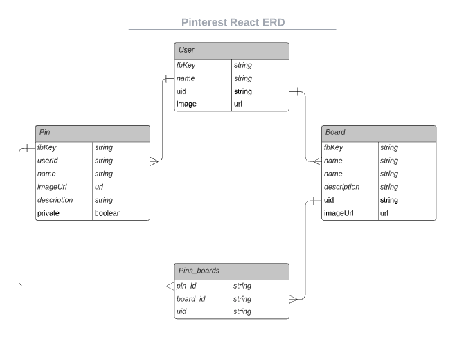

# React Pinterest

[Live Site](https://ec13-react-pinterest.netlify.app/)

[](https://app.netlify.com/sites/ec13-react-pinterest/deploys)


## Views
 


## Intial Plan Walk Through
- [Here is the overview](https://www.educreations.com/lesson/view/react-pinterest-planning/56971203/?s=Ysi5qH&ref=app) of what we decided as a class to complete for our React Pinterest project
- [Issue Ticket](https://github.com/nss-evening-cohort-13/student-help/issues/112) for discussion

## What do we need to build?
- [TODO](https://github.com/nss-evening-cohort-13/react-pinterest/blob/main/Monday.md)

### Views
- Home
- Boards
- Pins (see all the pins the user has created)
- SingleBoard (See all the pins on the board)
- PinDetails
- BoardForm
- PinForm

#### Example Routes using `react-router-dom`
```javascript
<Switch>
        <Route
          exact
          path='/'
          component={() => <Home authed={authed} />}
        />
        <Route
          exact
          path='/pin-details'
          component={() => <PinDetails authed={authed} />}
        />
        <Route
          exact
          path='/pins'
          component={() => <Pins authed={authed} />}
        />
        <Route
          exact
          path='/pin-form'
          component={() => <PinForm authed={authed} />}
        />
        <Route
          exact
          path='/single-board'
          component={() => <SingleBoard authed={authed} />}
        />
        <Route
          exact
          path='/boards'
          component={() => <Boards authed={authed} />}
        />
        <Route component={NotFound} />
      </Switch>
```

### Components
- Board
- Pin
- Main Container
- PinDetails
- Forms: Boards/Pins
- Navbar
- Loading (stretch)
- Search (stretch)
- Firebase Image Upload (stretch)
- Search History (stretch)
- Comments (stretch)

### Starter ERD



## Deployment
See detailed instructions [here](https://github.com/nss-evening-cohort-13/deploy-react-app-with-netlify/blob/main/README.md)

